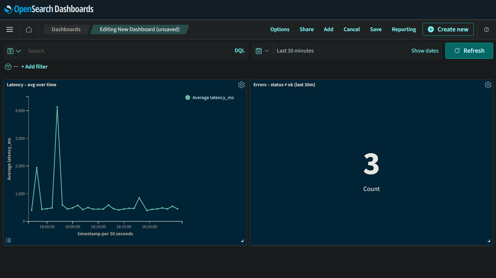
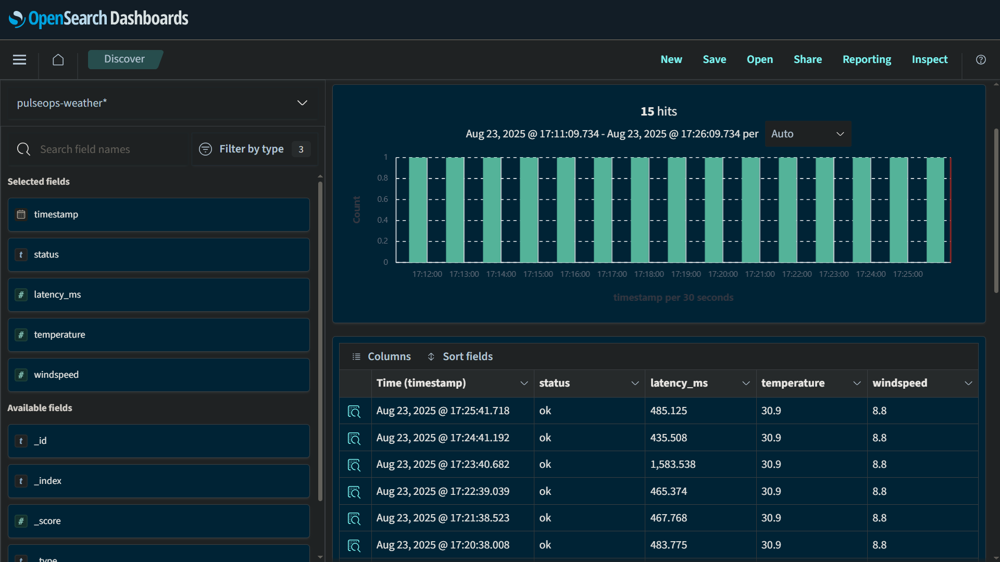

# ⚡ PulseOps — NOC Demo

One-command monitoring stack (**OpenSearch + Dashboards + Python Collector**)  
📊 Streams weather metrics → real-time **NOC-style dashboards**.

---

## 🖼️ Screenshots

<p align="center">
  
  
</p>

**Left:** NOC Dashboard — latency spikes & error counts (fault injection visible).  
**Right:** Discover view — raw weather telemetry (timestamp, status, latency, temp, wind).

---

## 💡 Why This Design

- **OpenSearch + Dashboards** → open-source, industry familiar, zero licensing friction  
- **Replay default** → stable demo + inject incident patterns not guaranteed live  
- **Fault injection** → practice anomaly detection (HTTP 500/429, latency spikes)  
- **Stable index mapping** → fields pre-defined for clean dashboards  
- **Single-node, no SSL/auth** → intentional for demo speed (prod differs)  

👉 Shows ability to stand up a monitoring stack, stream telemetry, simulate incidents, and visualize in a NOC-ready dashboard.

---

## 🛠️ Stack & Skills

**Stack:** Docker, OpenSearch, Dashboards, Python (`requests`, `opensearch-py`)  
**Skills shown:** Monitoring, log streaming, fault injection, incident simulation

---

## 🚀 Run

**Replay (default) — recommended for demo**
```bash
# Windows
docker compose up -d --build
# macOS / Linux
docker compose up -d --build
```

**Live — pull real weather (Open-Meteo)**
```powershell
# Windows (PowerShell)
$env:MODE="live"; docker compose up -d --build
```
```bash
# macOS / Linux
MODE=live docker compose up -d --build
```

Stop:
```bash
docker compose down
```

---

## 🔌 Access

- Dashboards (UI):  http://localhost:5601  
- OpenSearch API:   http://localhost:9200

---

## 📂 Project Structure
```
PulseOps/
├─ docker-compose.yml      # stack (OpenSearch + Dashboards + collector)
├─ collector/              # Python collector service (LIVE/REPLAY + faults)
│  ├─ collector.py
│  ├─ Dockerfile
│  └─ requirements.txt
└─ docs/screenshots/       # demo screenshots
```

---

## 🧯 Quick fixes

```bash
# See services
docker compose ps

# Tail collector logs
docker compose logs -f collector
```

Docker wonky on Windows? Restart Docker Desktop (tip: `wsl --shutdown`).

---

📜 MIT © PulseOps
